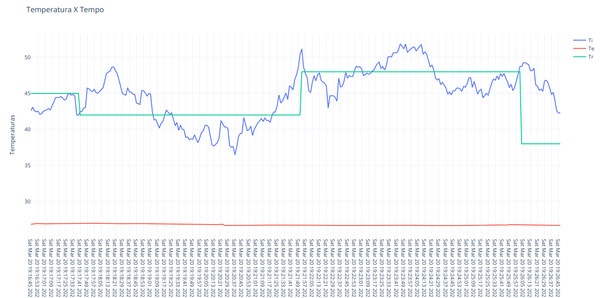
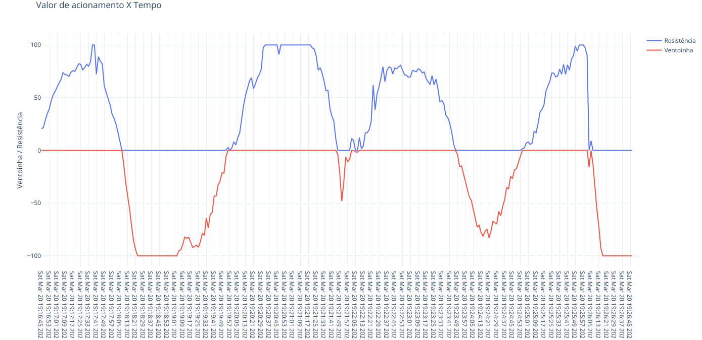

# p1_FSE_FGA
Projeto 1 da materia de Fundamentos de Sistemas Embarcados da FGA

Para compilar o programa insira make no terminal.

Para iniciar o programa vá para a pasta bin (cd bin) e execute o binario P1(./P1).

Para mudar a TR basta digita o numero desejado e dar enter(ex: 35.21).

Para utilizar a TR fornecida pelo potenciometro digite 'p' e de enter(desde que p seja o primeiro caractere irá funcionar).

Para mudar as constantes Kp, Ki e Kd digite no formato "kxn", onde n é um double(ex: 2.01232), e de enter.
Exemplo: "kp31.24" muda a constante kp para 31.24.

Caso o input seja invalido ele não sera computado e N sera impresso na area de input.

Não há como utilizar backspace.

As unicas teclas aceitas são numeros de 0 a 9, '.','d','i','k','p'.

Ao inserir um numero menor que a TE a TR sera igual a TE.

Ao inserir um numero maior que 100 a TR sera igual a 100.

O programa se encerra com ctrl+c ou ctrl+z.

O arquivo csv gerado se encontra na pasta log.

Graficos Kp=5, Ki=1, Kd=5;

Grafico de Temperaturas(TI,TE,TR) X Tempo.

Grafico de Valores de acionamento X Tempo.

